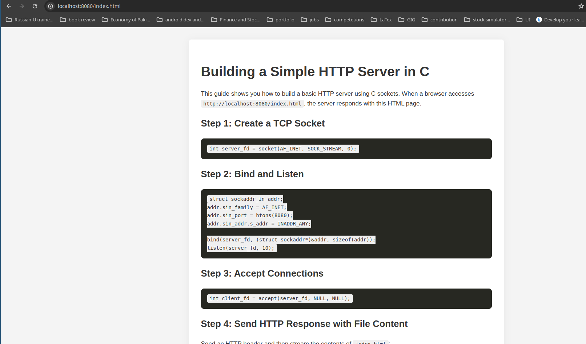

# Simple HTTP Server in C

A minimalist HTTP server written in C that serves an `index.html` file on port 8080.



## Prerequisites
- GCC compiler
- POSIX-compliant system (Linux, macOS, etc.)
- `index.html` file in the same directory as the server

## Build
```bash
gcc server.c -o server -pthread
```

## Run
```bash
./server
```

1. Place an `index.html` file in the same directory as the server.
2. Open a browser and navigate to `http://localhost:8080`.

## Notes
- The server handles GET requests for `/` and returns `index.html`.
- Other requests receive a 404 response.
- Uses POSIX threads for concurrent client handling.
- Ensure port 8080 is free.